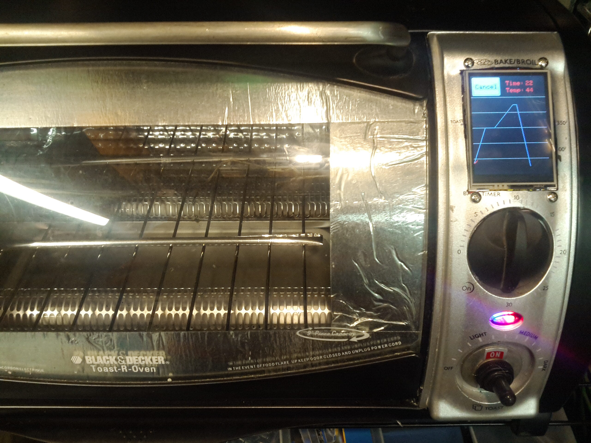

# ReflowOven
arduino nano based reflow oven

The code for this project is based on the Reflow Chateau project http://willfj.com/reflow-chateau/
it has been modified to work with a 2.4" TFT touch display & an arduino nano.

  
  

